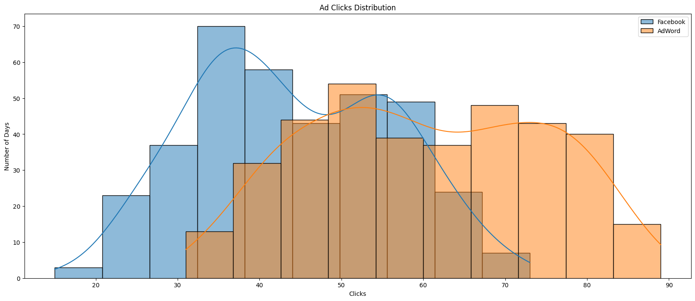
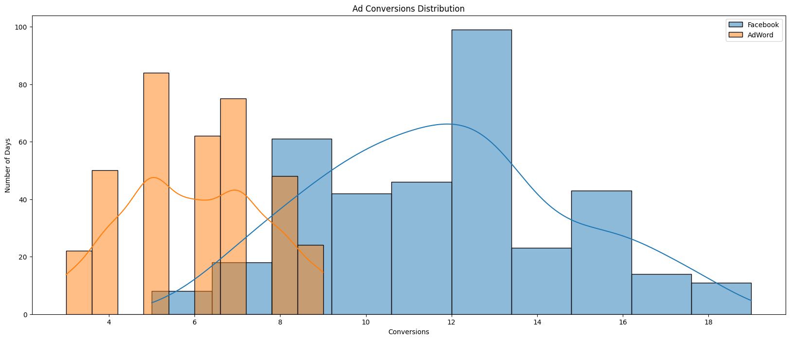
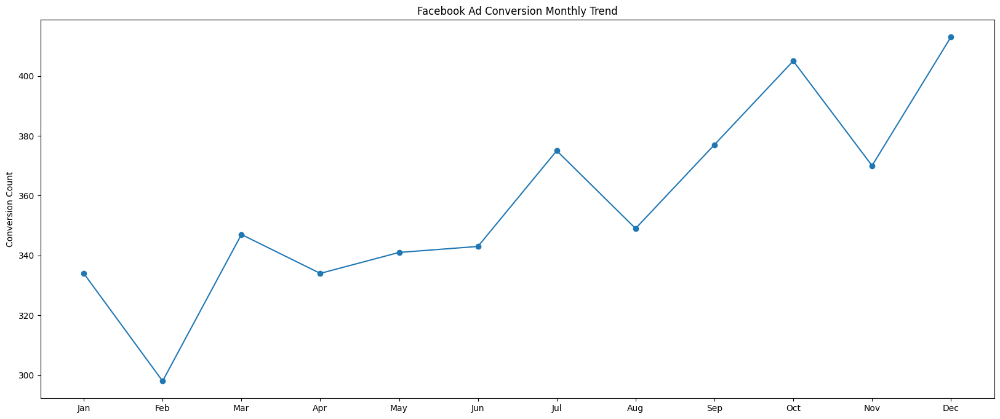
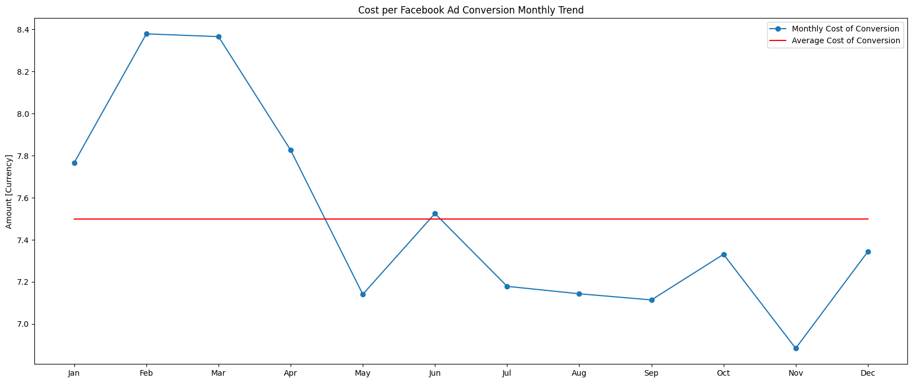
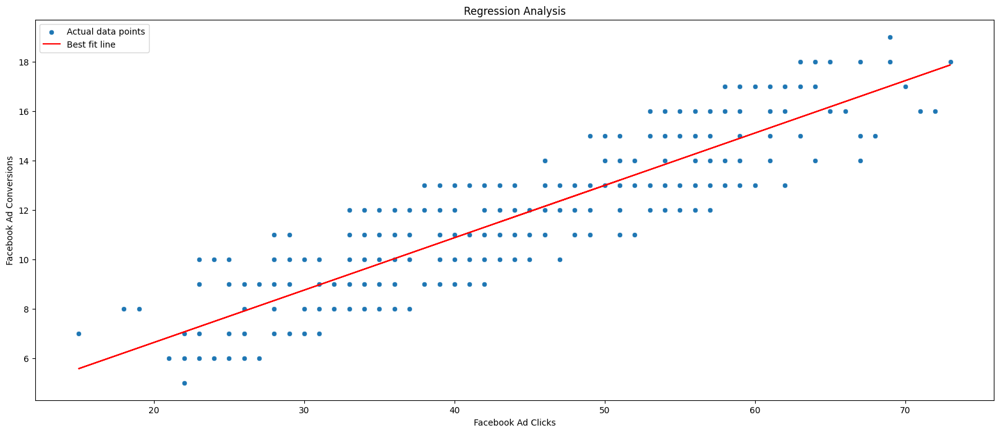

# ⚖️ A/B Testing & Regression Analysis for Marketing Campaign

## 📌 Project Overview

The purpose of this project is to maximize the return on investment (ROI) on advertising campaigns by comparing two ad campaigns, one on Facebook and the other on AdWords, and to determine which platform yields better results in terms of clicks, conversions, and overall cost-effectiveness. This can be used to allocate resources more efficiently and optimize advertising strategies to deliver better outcomes. This project applies **EDA** & **A/B Testing** to determine the winning platform for the Ad, **Regression Analysis** to predict the conversions from clicks on the platform, **Cointegration test** to verify the long term reltionship between ad spending and conversions.

---

## 📝 Data Description

The dataset includes daily Ad metrices, running simultaneously on Facebook and Adwords, for a year. Some metrices are:
1. Ad View
2. Ad Clicks
3. Ad Conversions
4. Cost per platform Ad
5. Click through Rate
6. Conversion Rate
7. Cost per click

---

## 📁 Project Structure

    ├── images/
    ├── data/
    │   └── marketing_campaign.csv
    ├── marketing_campaign_analysis.ipynb
    └──README.md

---

## 🎯 Results

- 
- 

- The data suggests Facebook had more frequent higher conversion days than AdWords, which either had very low conversion rates (less than 6) or moderate ones (6 - 10).
- A correlation coefficient of 0.87 indicates a strong positive linear relationship between clicks on Facebook ads and sales. This suggests that as the number of clicks on Facebook ads increases, sales tend to increase as well.
- The strong correlation between clicks on Facebook ads and sales suggests that Facebook advertising is highly effective in driving sales for the business. Increasing investment in Facebook ads or optimizing their performance could potentially lead to even higher sales.
- A correlation coefficient of 0.45 indicates a moderate positive linear relationship between clicks on AdWords ads and sales. While there is still a positive relationship, it is not as strong as with Facebook ads.
- Across the weekdays over a year, the average number of conversions remains relatively consistent, indicating a consistent level of engagement throughout the week. However, Mondays and Tuesdays consistently exhibit the highest conversion rates compared to other days, suggesting that the beginning of the workweek sees heightened user engagement or responsiveness to marketing efforts.

- 

- Examining the monthly trend in conversions reveals an overall upward trajectory, indicating a general increase in conversions over time. However, certain months stand out with variations in conversion rates. These periods of decreased conversion rates could be influenced by factors such as seasonal fluctuations, changes in consumer behavior, or adjustments in marketing strategies.

- 

- Consider allocating more advertising budget to months with historically lower CPC values (e.g., May and November) to maximize ROI.

- 📊 **A/B Test Result**: 

- The mean number of conversions from Facebook ads (11.74) is substantially higher than the mean number of conversions from AdWords ads (5.98). This suggests that, on average, Facebook advertising is more effective in generating conversions compared to AdWords advertising.
- The T statistic (32.88) and p-value (9.35e-134) strongly support the alternate hypothesis, indicating that the number of conversions from Facebook advertising is indeed greater than the number of conversions from AdWords advertising.
- Given the significant difference in conversion rates between Facebook and AdWords, consider reallocating resources towards Facebook advertising efforts. This could involve increasing ad spend, expanding targeting efforts, or experimenting with different ad formats to capitalize on the platform's effectiveness in driving conversions.

- 📈 **Regression Results**: 

- 

- The model has a reasonably good predictive power, with an R2 score of 76.35%. This suggests that it can effectively predict Facebook ad conversions based on the number of Facebook ad clicks.
- With the insights provided by the Linear Regression model, businesses can make informed decisions about resource allocation, budget planning, and campaign optimization.
- For instance, knowing the expected number of Facebook ad conversions based on a certain number of Facebook ad clicks can help in setting realistic campaign goals, optimizing ad spend, and assessing the ROI of Facebook advertising efforts.

- 🔍 **Cointegration Test**

- Since the p-value (2.13e-26) is significantly lower than the chosen significance level (0.05), we reject the null hypothesis. This indicates that there is a long-term equilibrium relationship between advertising spend (cost) and conversions.
- Businesses can use this understanding of the stable relationship between cost and conversions to optimize their advertising strategies. By investing in campaigns that demonstrate a strong return on investment (ROI) and adjusting spending based on performance, companies can maximize conversions while minimizing costs.

---

## 🛠️ Dependencies

pandas, numpy, matplotlib, seaborn, scipy, statsmodels/scikit-learn

---

## 🚀 Future Work

-PowerBI Dashbord

---

## 👨‍💻 Author

Nilesh Gorai\
GitHub: https://github.com/nileshgorai-byte
Mail id: nileshgorai97@gmail.com
